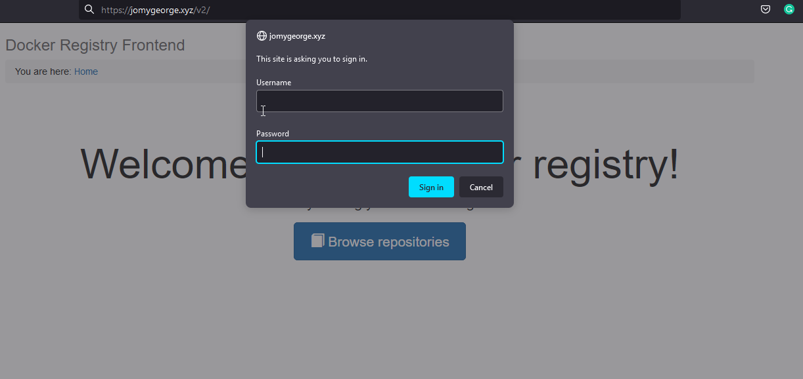
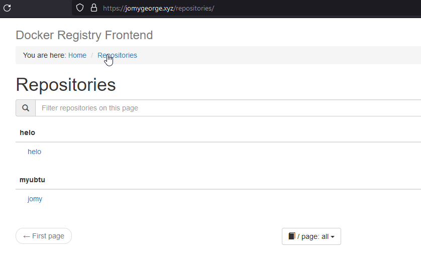
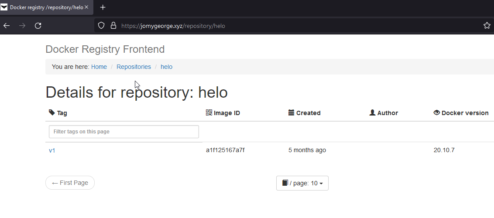

# Private docker registry

[](https://travis-ci.org/joemccann/dillinger)


## Description

Docker Registry is a server-side application and part of Docker’s platform-as-a-service product. It allows you to locally store all your Docker images into one centralized location. When you set up a private registry, you assign a server to communicate with Docker Hub over the internet. The role of the server is to pull and push images, store them locally, and share them among other Docker hosts.By running an externally-accessible registry, you can save valuable resources and speed up processes. The software lets you pull images without having to connect to the Docker Hub, saving up bandwidth and securing the system from potential online threats. Docker hosts can access the local repository over a secure connection and copy images from the local registry to build their own containers.

## Pre-Requests
- Need to install docker and docker-compose

### Docker installation 

```sh
yum install docker -y after docker installation, please start and enable it
```
### docker-compose installation

```sh
sudo curl -L "https://github.com/docker/compose/releases/download/1.29.2/docker-compose-$(uname -s)-$(uname -m)" -o /usr/bin/docker-compose
sudo chmod +x /usr/bin/docker-compose
docker-compose version   
```
> You need to create a SSL certificate for the domain which you are using. Here am created a ssl certificate from https://www.sslforfree.com/ which is very simple using DNS validation.
> The created certs where placed on the /certs folder as below and created a HTTP authentication using httpd-tools

```
#auth~/ htpasswd -Bc registry.password username      ### This will create a authentication file under auth folder
```
```
~]# tree
.
├── auth
│   └── registry.password
├── certs
│   ├── server.crt                         <<<<<<<<<<<<<<<<<<<  This is certificate.crt + ca_bundle.crt file
│   └── server.key
└── docker-compose.yml

2 directories, 4 files
```
```sh
version: '3'
services:
  registry:

    image: registry:2
    ports:
    - "5000:5000"

    environment:

      - REGISTRY_AUTH=htpasswd
      - REGISTRY_AUTH_HTPASSWD_REALM=Registry Realm
      - REGISTRY_AUTH_HTPASSWD_PATH=/auth/registry.password
      - REGISTRY_STORAGE_FILESYSTEM_ROOTDIRECTORY=/data
      - REGISTRY_HTTP_ADDR=0.0.0.0:5000
      - REGISTRY_HTTP_TLS_CERTIFICATE=/certs/server.crt
      - REGISTRY_HTTP_TLS_KEY=/certs/server.key

    volumes:
      - data:/data
      - ./certs:/certs
      - ./auth:/auth

    networks:
      - registry_net

  frontend:
    environment:
     - ENV_DOCKER_REGISTRY_HOST=registry
     - ENV_DOCKER_REGISTRY_PORT=5000
     - ENV_DOCKER_REGISTRY_USE_SSL=1
     - ENV_USE_SSL="yes"
    volumes:
     - ./certs/server.crt:/etc/apache2/server.crt:ro
     - ./certs/server.key:/etc/apache2/server.key:ro
    ports:
     -  443:443
    image: konradkleine/docker-registry-frontend:v2
    networks:
     - registry_net

volumes:
  data:
networks:
  registry_net:
  ```
### How to run the compose
```
> docker-compose config              # To check the syntax

> RUn docker-compose up -d           #--> This will create all the requirement which we have added on the yml file

> docker-compose ps   

### After creation
```
```
 ~]# docker container ls
CONTAINER ID   IMAGE                                      COMMAND                  CREATED          STATUS          PORTS                                           NAMES
a09e0b79965d   registry:2                                 "/entrypoint.sh /etc…"   48 minutes ago   Up 48 minutes   0.0.0.0:5000->5000/tcp, :::5000->5000/tcp       root_registry_1
525d3c1078bf   konradkleine/docker-registry-frontend:v2   "/bin/sh -c $START_S…"   48 minutes ago   Up 48 minutes   80/tcp, 0.0.0.0:443->443/tcp, :::443->443/tcp   root_frontend_1
```
> How to push the image to our private registry
```
I have pulled a ubuntu image from docker hub and tagged our registry name
~# docker tag ubuntu  jomygeorge.xyz:5000/os:latest
~]# docker login jomygeorge.xyz:5000
Authenticating with existing credentials...
WARNING! Your password will be stored unencrypted in /root/.docker/config.json.
Configure a credential helper to remove this warning. See
https://docs.docker.com/engine/reference/commandline/login/#credentials-store

Login Succeeded
]# docker push jomygeorge.xyz:5000/os:latest
The push refers to repository [jomygeorge.xyz:5000/os]
36ffdceb4c77: Mounted from myubtu/jomy
latest: digest: sha256:7c9c7fed23def3653a0da5bc9ecb651efe155ebd5802c7ba5d585edaa6c89496 size: 529
```
> How to pull the image to our private registry
```
 ~]# docker pull jomygeorge.xyz:5000/helo:v1
v1: Pulling from helo
2db29710123e: Pull complete
Digest: sha256:f54a58bc1aac5ea1a25d796ae155dc228b3f0e11d046ae276b39c4bf2f13d8c4
Status: Downloaded newer image for jomygeorge.xyz:5000/helo:v1
jomygeorge.xyz:5000/helo:v1
~]# docker image ls
REPOSITORY                              TAG       IMAGE ID       CREATED        SIZE
jomygeorge.xyz:5000/helo                v1        feb5d9fea6a5   5 months ago   13.3kB
```
## Conclusion
Our private registry is now live with frontend

## Sample snaps

<center> </img></center>
<center> </img></center>
<center> </img></center>

#### ⚙️ Connect with Me

<p align="center">
<a href="mailto:jomyambattil@gmail.com"></a>
<a href="https://www.linkedin.com/in/jomygeorge11"></a> 
<a href="https://www.instagram.com/therealjomy"></a><br />
